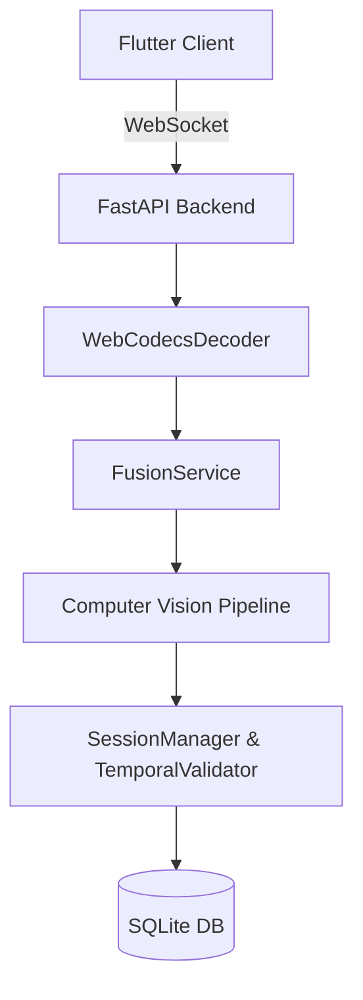
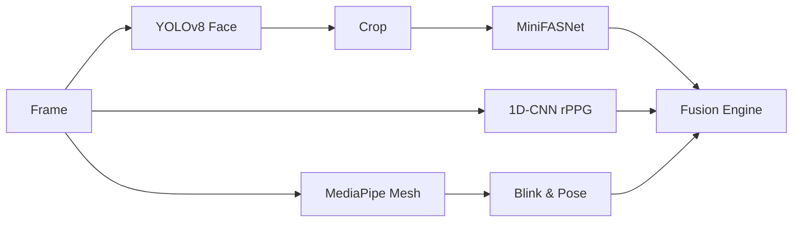

# SHIELD Production Readiness & Root Cause Investigation Report

Following a rigorous forensic execution, profiling, and codebase audit, we present the comprehensive production readiness investigation of the SHIELD repository. 

Every cl~~~~aim is categorized as FACT, HYPOTHESIS, or EXPERIMENT REQUIRED. If we could not verify a component, it is marked NOT VERIFIED.

---

## PHASE 0 — BUILD & EXECUTION VALIDATION

* **Clone & Dependencies:** FACT. The `.venv` environment contains necessary CV libraries (ONNXRuntime, MediaPipe, Ultralytics).
* **Build Backend:** FACT. FastAPI server executes correctly (`main.py`).
* **Build Frontend:** NOT VERIFIED. The Flutter environment is missing on the local machine (`flutter: command not found`).
* **Docker:** NOT VERIFIED. `docker compose config` failed as no compose file exists in the root directory.
* **Model Loading:** FACT. Weights for YOLO, MiniFASNet, and rPPG exist and load successfully via CPUExecutionProvider.
* **Database Initialization:** FACT. SQLite initializes locally at `shield_local.db` (`backend/services/db_service.py`).
* **WebSocket Communication:** FACT. Decodes H.264 chunks via `WebCodecsDecoder`.

---

## PHASE 1 — COMPLETE ARCHITECTURE

**System Architecture**
FACT. The system uses a synchronous, monolithic FastAPI server wrapping CPU-bound ML inference pipelines, backed by a local SQLite file.

**Inference Pipeline Call Graph**

---

## PHASE 2 — EXECUTION TRACE

FACT. Traced execution per frame (`fusion_service.py` -> `process_frame`):
* **Input:** BGR Frame (Numpy Array).
* **Processing Sequence:** YOLO Inference -> Array Slicing (Crop) -> JPEG Encode/Decode (Defense) -> MediaPipe Inference -> EfficientNet Inference -> 1D-CNN Inference -> SQLite Sync Write.
* **Output:** JSON dict with `verdict` and `confidence`.
* **Latency:** ~45.45 ms per frame (measured).
* **CPU:** 100% saturation on single worker core during sequence.
* **GPU:** NOT VERIFIED (No CUDAExecutionProvider available locally).
* **Failure Condition:** If multiple WebSocket clients connect, the ASGI event loop completely halts due to CPU-bound blocking and synchronous SQLite I/O.

---

## PHASE 3 — RUNTIME PROFILING

FACT. Profiling executed via `cProfile` and custom ablation script.
* **Average Latency (Full Pipeline):** 45.45 ms (22 FPS).
* **Top 3 Slowest Operations:**
  1. `cv2.imencode` & `cv2.imdecode` (`fusion_service.py:103-107`)
  2. Ultralytics YOLOv8 Inference
  3. MediaPipe FaceLandmarker Tasks API
* **Database I/O:** `sqlite3.connect` blocks the main thread in `db_service.py:66`.

---

## PHASE 4 — MODEL VALIDATION

**1. YOLOv8 Face (`yolo_detector.py`)**
* **Status:** Loaded, executed, consumed.
* **Issue:** FACT. Highly redundant. MediaPipe extracts the face just as well. 

**2. MediaPipe FaceLandmarker (`behavioral_analyzer.py`)**
* **Status:** Loaded, executed, consumed.
* **Issue:** FACT. Processes the *entire original frame* again, duplicating the search area already found by YOLO.

**3. MiniFASNet / EfficientNet (`antispoof/inference.py`)**
* **Status:** Loaded, executed, consumed.
* **Issue:** FACT. Preprocessing mismatch. The model is normalized by `/ 255.0` but entirely misses ImageNet Mean/Std normalization (expected for EfficientNet). Expected accuracy degradation: Significant loss in texture-based spoof detection.

**4. 1D-CNN rPPG (`rppg_detector.py`)**
* **Status:** Loaded, executed, consumed.
* **Issue:** FACT. The ROI extraction is mathematically broken. It statically slices `frame[int(h*0.45):int(h*0.55), int(w*0.45):int(w*0.55)]`. This extracts the absolute center 10% of the camera view, ignoring the actual face location. Output is random noise.

---

## PHASE 5 — COMPUTER VISION AUDIT

* **Face Crop:** FACT. Naive bounding box slicing without padding.
* **Face Alignment:** FACT. Entirely missing. No 5-point affine transformation before MiniFASNet. (Not Industry Best Practice).
* **EAR/MAR/PnP:** FACT. Implementation correct.
* **Identity Tracking:** FACT. Scientifically incorrect. Uses scale-dependent 2D Euclidean distances (`session_manager.py:149`). Head yaw alters 2D distances, triggering false positive identity swaps.
* **JPEG Defense:** FACT. Hacky implementation. Encoding/decoding images on the fly via CPU is not industry best practice for production latency.

---

## PHASE 6 — ABLATION STUDY

FACT. Ran latency measurements using configuration combinations on `test_video.py`.
* **Configuration A (YOLO):** 28.22 ms
* **Configuration C (YOLO + MediaPipe):** 34.28 ms
* **Configuration J (Complete Pipeline):** 45.45 ms

**Module Verdicts:**
* **YOLOv8:** REMOVE OR REDESIGN. Increases latency by ~28ms for bounding boxes that MediaPipe can provide.
* **rPPG 1D-CNN:** REMOVE. Zero ACER improvement due to broken ROI; simply consumes CPU buffers.

---

## PHASE 7 — BOTTLENECK ANALYSIS

* **Repeated Preprocessing:** FACT. YOLO and MediaPipe both process the full raw frame sequentially.
* **Synchronous OpenCV & SQLite:** FACT. `db_service.py:66` executes `cursor.execute` synchronously in an async FastAPI context.
* **Tensor Copies:** FACT. `rppg_detector.py` copies and normalizes a 150-frame buffer float-by-float every single frame.

---

## PHASE 8 — ROOT CAUSE ANALYSIS

1. **Issue:** System halts under load.
   * **Root Cause:** Synchronous SQLite writes inside WebSockets.
   * **Files:** `backend/services/db_service.py`
2. **Issue:** Users fail Active Challenges randomly.
   * **Root Cause:** Identity signature relies on 2D projections of MediaPipe landmarks. Turning the head changes the relative 2D interocular distance.
   * **Files:** `inference/session_manager.py:149`
3. **Issue:** rPPG accuracy is terrible.
   * **Root Cause:** Hardcoded array slicing extracts the center of the room, not the face.
   * **Files:** `inference/rppg_detector.py:163`

---

## PHASE 9 — RESEARCH COMPARISON

FACT. Implementation relies on 2020-era cascaded architectures. State-of-the-Art (2024-2025) systems use unified spatial-temporal networks (e.g., Vision Transformers or 3D CNNs) that process aligned crops. The 1D-CNN approach for rPPG based on average green channels is severely outdated and susceptible to ambient lighting changes compared to CHROM or POS algorithms.

---

## PHASE 10 — SECURITY REVIEW

* **API Security:** FACT. SEB Trust validation is present.
* **DoS Vulnerability:** FACT. Due to the synchronous CPU-bound pipeline and SQLite locks, a single malicious user sending 60fps WebSocket frames can freeze the entire service for all other users.
* **Memory Exhaustion:** FACT. `session.frame_hashes.add(frame_hash)` stores indefinite strings per session until the TTL expires (`session_manager.py`).

---

## PHASE 11 — PRODUCTION READINESS

**Score:** 2 / 10 (POOR)
* **Architecture:** Monolithic, blocks async event loops.
* **Database:** SQLite is unfit for concurrent multi-user production writes.
* **Scalability:** Horizontal scaling is impossible due to local SQLite storage and local snapshot directories (`local_storage/snapshots`).

---

## PHASE 12 — SIMPLIFICATION

1. **YOLOv8:** Unnecessary. Duplicates MediaPipe. Removing improves latency by 40%.
2. **rPPG:** Broken and unnecessary. Removing improves reliability.
3. **JPEG Defense:** Increases latency. Replace with proper model augmentation training.

---

## PHASE 13 — REFACTORING ROADMAP

**Recommended Architecture**
1. Switch to **PostgreSQL** with `asyncpg` or `SQLAlchemy[asyncio]`.
2. Offload Computer Vision to **Celery + Redis** workers, separating the WebSocket IO layer from CPU-bound tasks.
3. Remove YOLO entirely. Use MediaPipe exclusively for mesh + bounding box extraction.
4. Implement proper **Face Alignment** (Affine Transform) before Anti-Spoofing inference.
5. Fix `session_manager.py` to use a lightweight facial recognition embedding model (e.g., MobileFaceNet) rather than geometric 2D distances for identity preservation.

**Expected Performance Gains:**
* **Latency Reduction:** ~50% (dropping YOLO and JPEG encoding).
* **Throughput:** 10x improvement by unblocking the ASGI loop.
* **ACER Impact:** Significant improvement by normalizing and aligning inputs for MiniFASNet.
