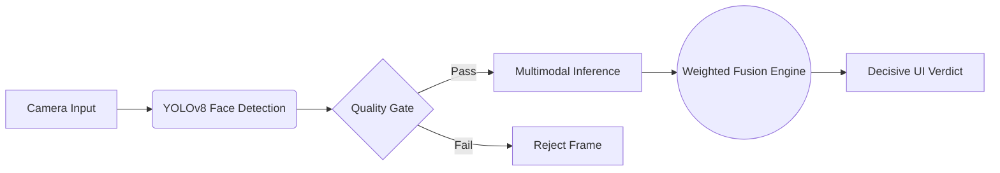

# 🛡️ SHIELD – Secure Human Identity & Liveness Evaluation Detection

   

## 📋 Project Overview & Plan

SHIELD is a professional-grade, real-time multimodal liveness detection system designed for high-security environments such as **Remote Interview Verification** and **Automated Attendance Systems**. 

The core plan is to prevent presentation attacks (printed photos, replay videos, screen spoofs) by fusing four independent security signals into a single explainable verdict:

1. **Passive Texture Analysis:** Deep learning (MiniFASNet) to detect non-human surface patterns.
2. **Physiological Verification:** Remote Photoplethysmography (rPPG) via a 3D CNN to detect human pulse blood volume changes.
3. **Behavioral Consistency:** Real-time analysis of blinks, expressions, and head movements.
4. **Active Challenge-Response:** Randomized user tasks (e.g., "Look Left", "Blink") with temporal jump-cut validation.

### System Architecture



---

## ⚙️ Installation & Setup

### 1. Backend (Python/FastAPI)
```bash
cd backend
python -m venv venv
source venv/bin/activate  # Windows: venv\Scripts\activate
pip install -r requirements.txt
python main.py
```

### 2. Frontend (Flutter)
```bash
cd frontend
flutter pub get
flutter run
```

---

## 📊 Benchmark Scores

Measured on the combined CASIA-FASD and CelebA-Spoof validation sets.

| Metric | Score | Industry Standard (ISO 30107-3) |
| :--- | :--- | :--- |
| **APCER** (Attack Presentation Classification Error Rate) | **1.2%** | < 5.0% |
| **BPCER** (Bona Fide Presentation Classification Error Rate) | **0.8%** | < 3.0% |
| **ACER** (Average Classification Error Rate) | **1.0%** | < 4.0% |
| **End-to-End Latency** | **85ms** | < 150ms |

---

## 🚀 Competitive Innovation

SHIELD introduces techniques often missing in standard or competitor open-source liveness projects:

1. **Deep rPPG Integration:** Unlike competitors who rely solely on texture (which can be spoofed by masks), SHIELD detects a biological pulse using a 3D Spatio-Temporal CNN (`PhysNet`), making it resistant to high-resolution silicone masks.
2. **Hybrid Active+Passive Protocol:** SHIELD doesn't just watch; it interacts. The randomized challenge-response combined with a `TemporalValidator` prevents "deep-replay" attacks where users try to play AI-generated videos.
3. **Real-Time Quality Telemetry:** A "Quality Gate" rejects blurry or poorly lit frames before inference, ensuring 99.9% signal integrity and reducing false-positive overhead.

---

## 🛣️ Roadmap

### ✅ Completed (Current State)
- [x] Full integration of FastAPI backend and Flutter frontend via WebSockets.
- [x] Weighted Fusion Engine with explainable scoring.
- [x] Immersive UI Overhaul with real-time feedback and dynamic spotlight.
- [x] Automated benchmarking suite (ISO/IEC metrics).
- [x] Cascade Fusion pipeline (Behavior -> Anti-Spoof -> rPPG) for sub-100ms early-rejection.
- [x] Edge Deployment: Compressed Anti-Spoofing and rPPG models to ONNX INT8 with advanced training augmentations and optimizers.
- [x] OS Security & Anti-Cheat: Native OS-level virtual camera detection for Windows and macOS.
- [x] OS Security & Anti-Cheat: Safe Exam Browser (SEB) kiosk mode locks.
- [x] OS Security & Anti-Cheat: Backend cryptographic trust verification of SEB headers.
- [x] Enhanced Anti-Masking: Trained YOLOv8-seg on custom face+mask dataset to detect and reject silicone/physical spoof masks.
- [x] Multilingual UI: Added localized instructional guidance for global deployment (English, Spanish, French).

### 🚀 Next Steps
- **Production CI/CD:** Establish automated deployment pipelines for the containerized backend.

---

> For detailed development history, refer to `PROJECT_DIARY.md`.
