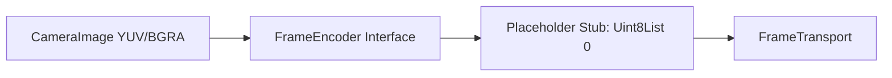
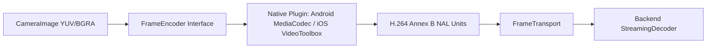

# Hardware Encoder Epic

## Current Architecture (Placeholder)

## Future Architecture (Production Target)

## Responsibilities & Plugin Boundaries
- **FrameEncoder Interface**: Must remain a pure Dart interface yielding a stream or callback of `Uint8List` representing NAL chunks.
- **Native Plugin Boundaries**: The plugin is strictly responsible for zero-copy memory mapping of Dart `CameraImage` planes to the hardware encoder. It must NOT handle network sockets, WebSockets, or business logic.
- **FrameTransport**: Responsible exclusively for appending JSON metadata and pushing the `Uint8List` over the WebSocket. Must not be modified.
- **StreamingDecoder**: Consumes Annex B natively. Must not be modified.

**Integration Guide for Future Engineers:**
1. Implement a Flutter plugin (e.g., `shield_hardware_encoder`).
2. Pass `CameraImage.planes` (or a `TextureId`) into the plugin asynchronously.
3. Configure the native codec for `video/avc` (H.264).
4. Emit Annex B byte arrays back to Dart.
5. Provide this plugin as the concrete implementation of the `FrameEncoder` interface injected into `CurrentWebSocketTransport`.
**No backend, protocol, or fusion changes are required.**
