# SHIELD System Architecture Documentation

## DIAGRAM 1: Overall System Architecture
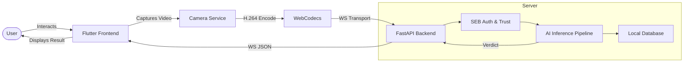

## DIAGRAM 3: Backend Architecture
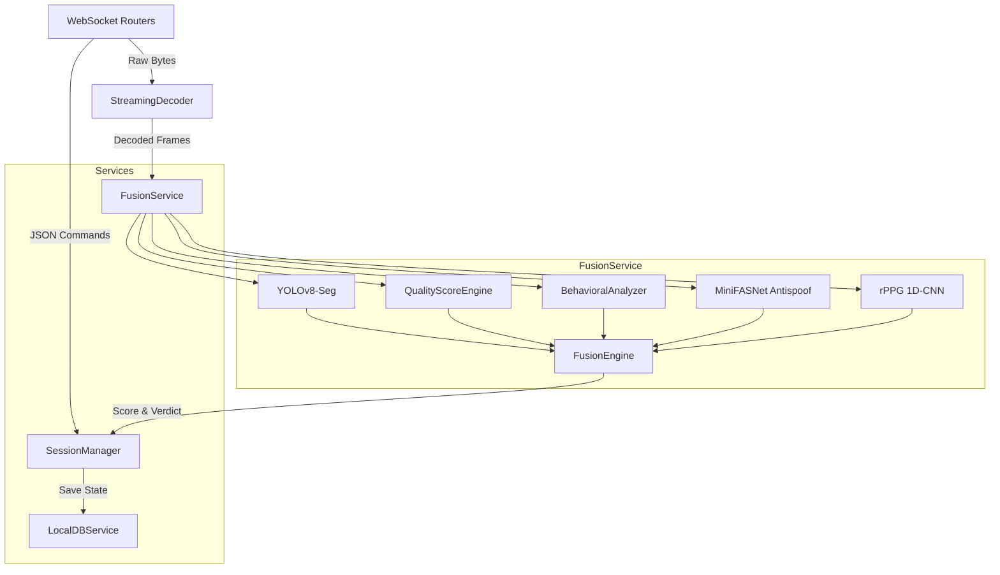

## DIAGRAM 4: Frontend Architecture
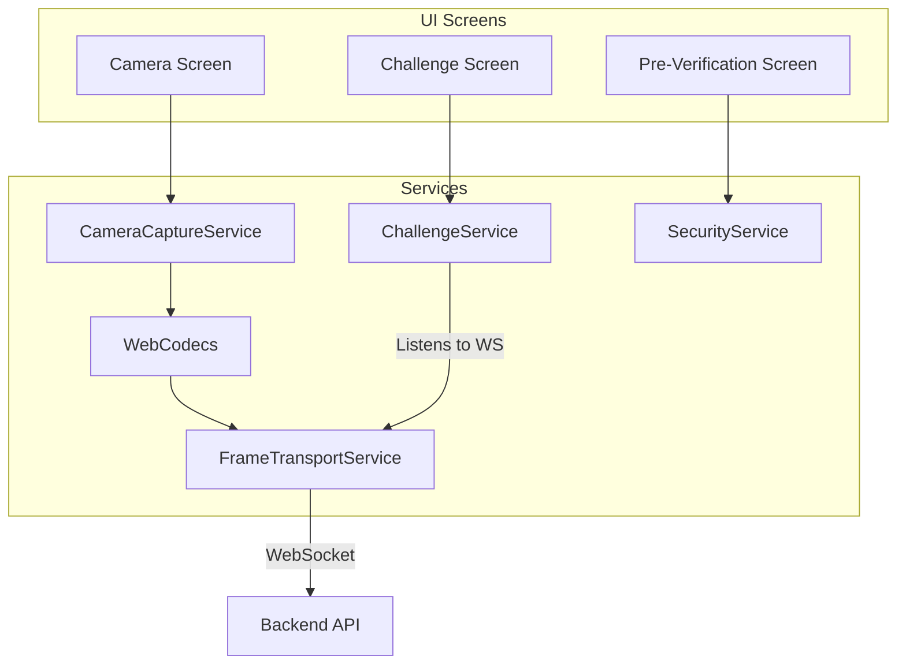

## DIAGRAM 5: Request Lifecycle
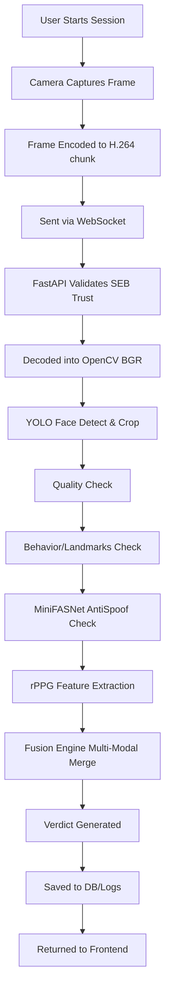

## DIAGRAM 6: AI Inference Pipeline
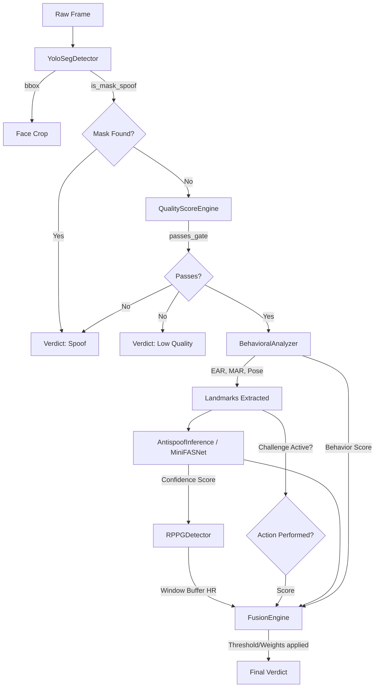

## DIAGRAM 7: Fusion Engine
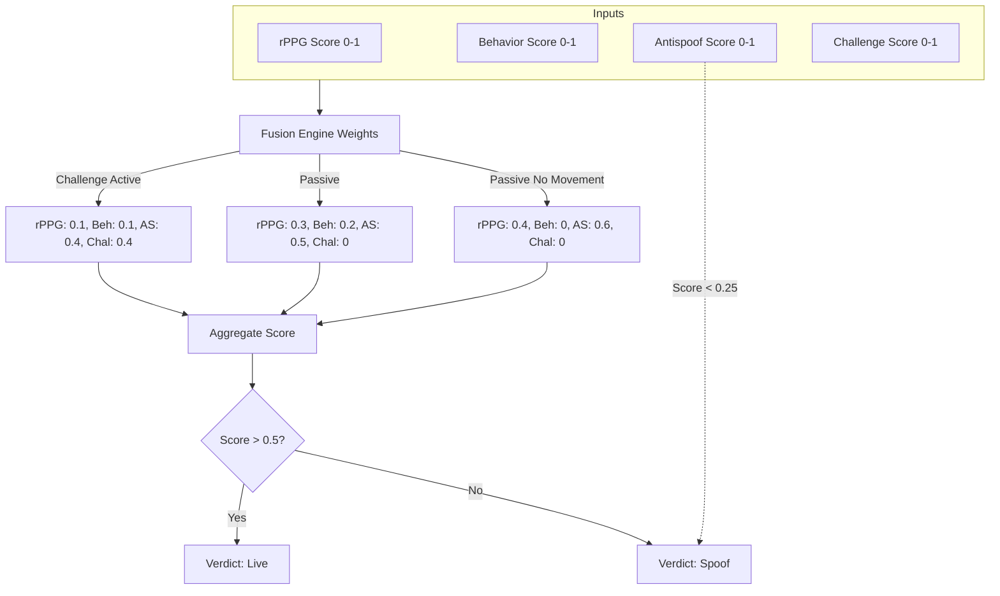

## DIAGRAM 8: Sequence Diagram
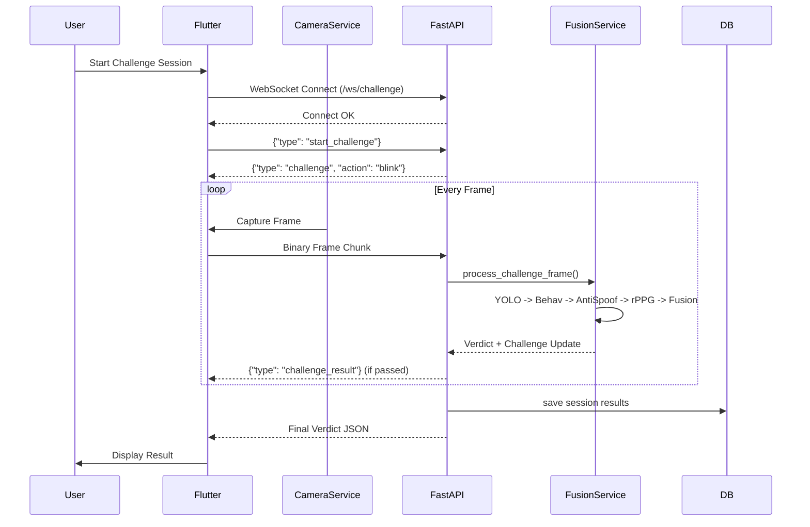

## DIAGRAM 9: Activity Diagram
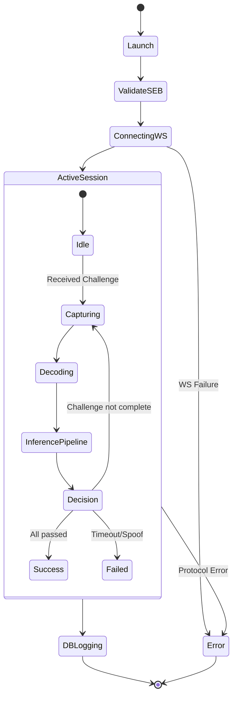

## DIAGRAM 10: State Diagram (Session)
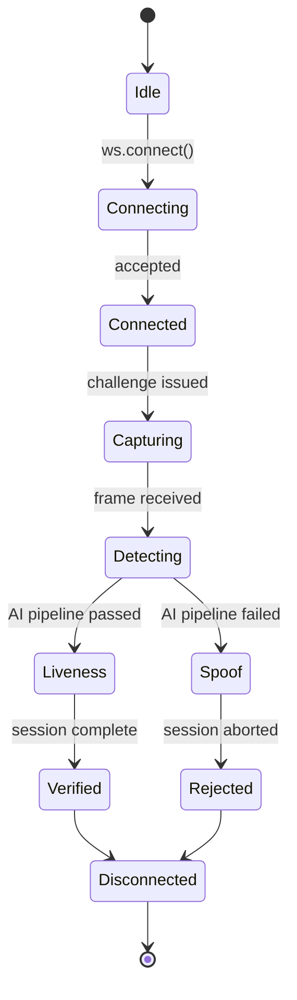

## DIAGRAM 11: Database ER Diagram
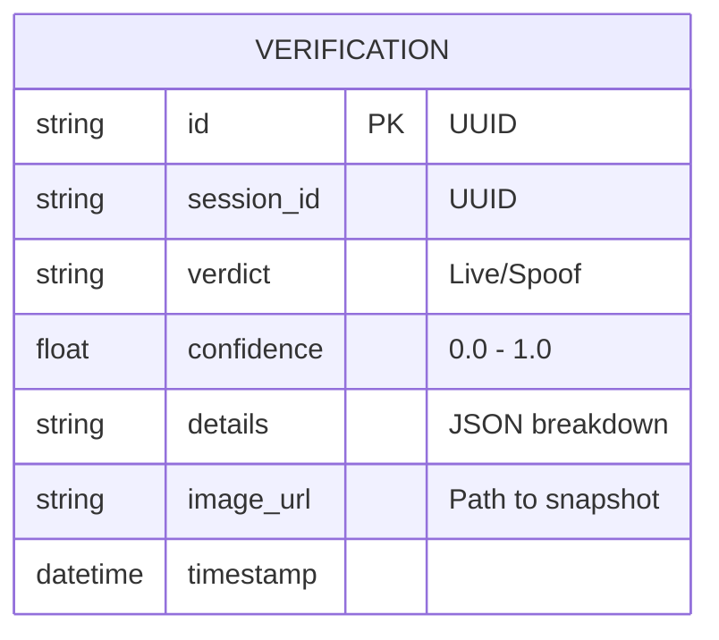

## DIAGRAM 12: Deployment Diagram
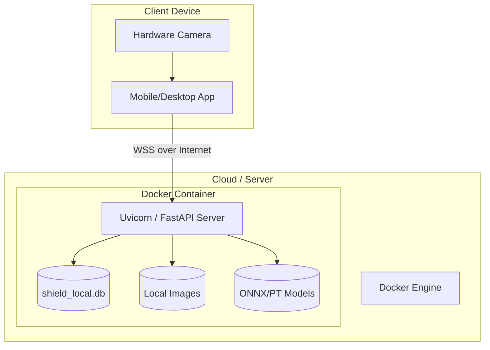

## DIAGRAM 13: Docker Architecture
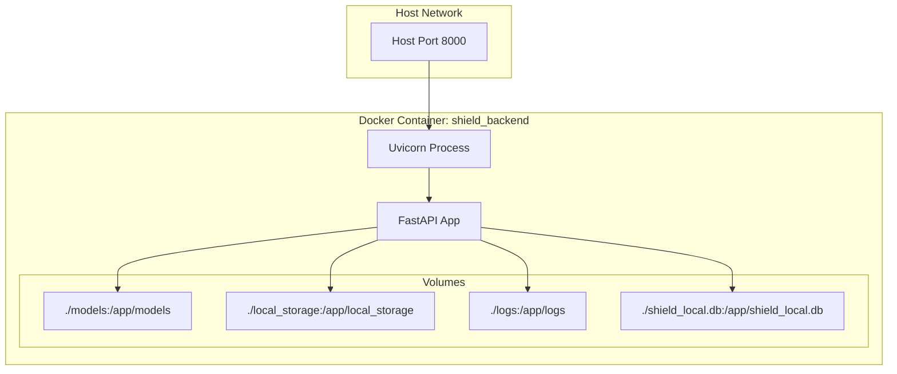

## DIAGRAM 14: API Communication
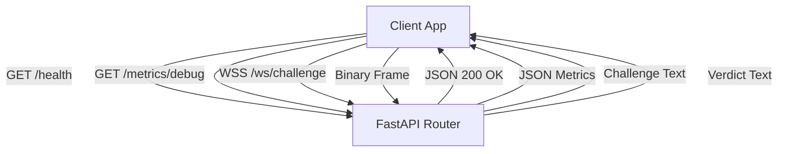

## DIAGRAM 15: Data Flow Diagram (Level 1)
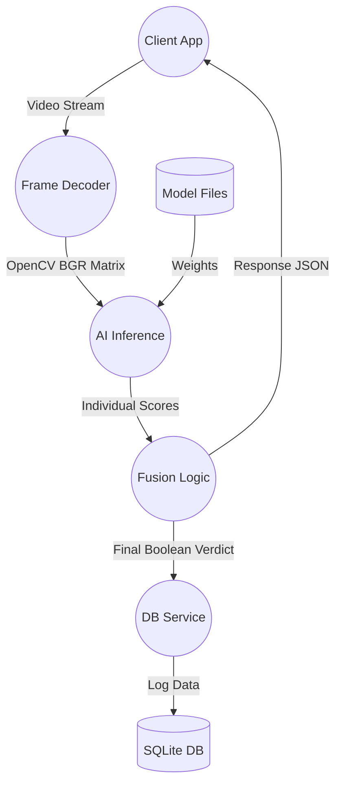

## DIAGRAM 16: Component Diagram
```mermaid
componentDiagram
    [Client Frontend (Flutter)] as Client
    [WebSocket Manager] as WS
    [Video Decoder Service] as Video
    [AI Fusion Engine] as AI
    [Database Service] as DB
    
    Client --> WS : Uses
    WS --> Video : Depends on
    WS --> AI : Depends on
    WS --> DB : Depends on
```

## DIAGRAM 17: Execution Timeline
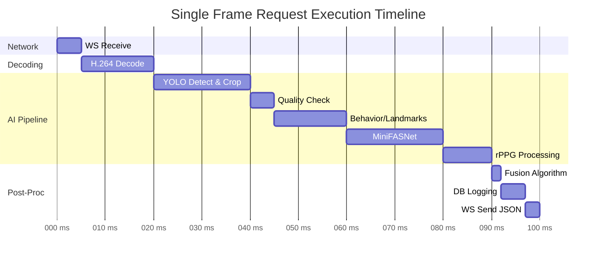
