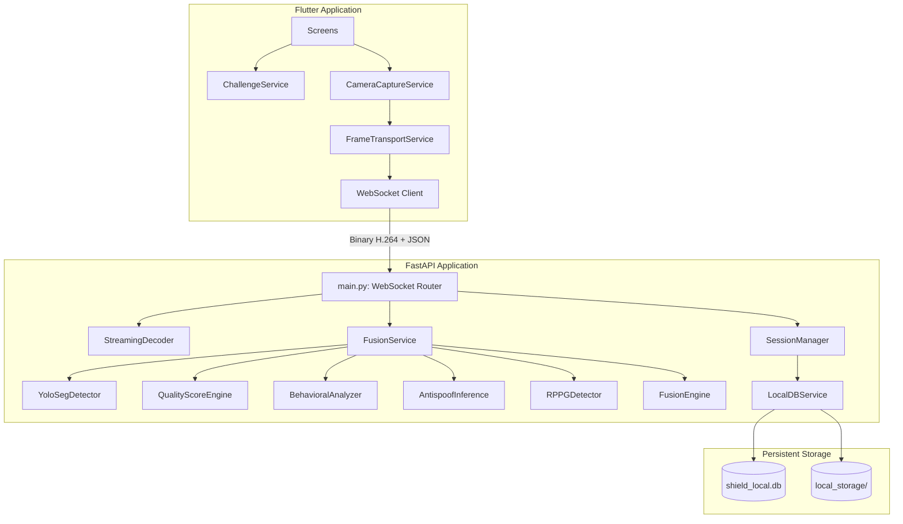

# SHIELD - Dependency Graph & Components

## Detailed Explanations
- **Flutter Frontend**: Uses `CameraCaptureService` to continuously retrieve camera frames. These frames are pushed to `FrameTransportService`, which manages backpressure, queues, and encodes them using webcodecs.
- **WebSockets**: Serves as the high-throughput pipeline. Binary frames are interlaced with JSON metadata.
- **FastAPI / StreamingDecoder**: Receives the binary payload, decodes the H.264 chunks into OpenCV BGR frames.
- **FusionService**: The core orchestrator. Passes the frame sequentially through detection (YOLO), quality, behavioral, antispoof (MiniFASNet), and physiological (rPPG) checks.
- **FusionEngine**: Applies weighting algorithms (dynamically adjusted based on active challenges vs passive state) to merge model outputs into one verdict.
- **SessionManager**: Keeps track of challenges passed, timestamps, and prevents timeouts/identity swaps.
