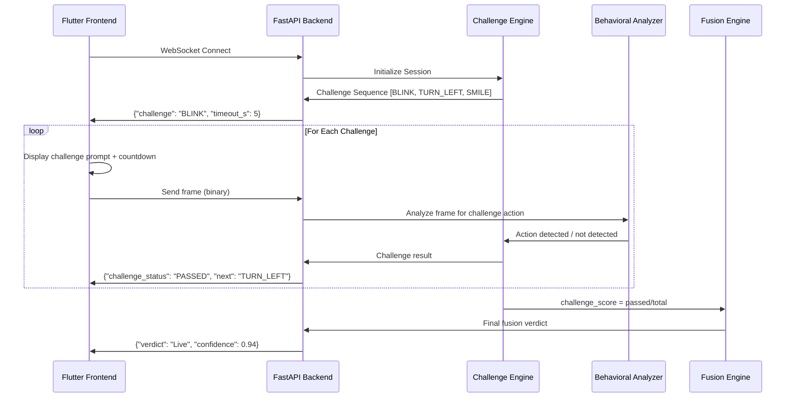
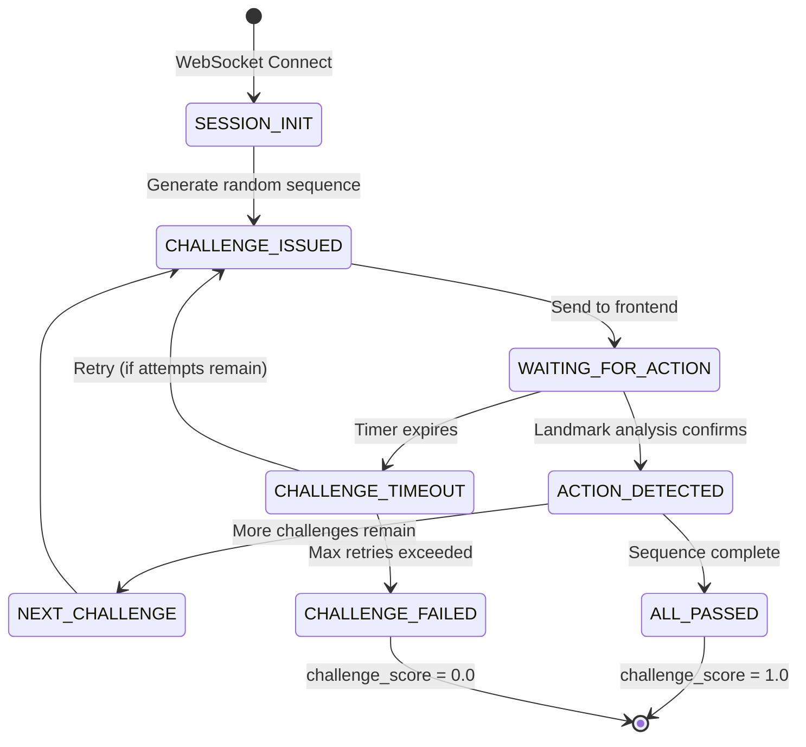
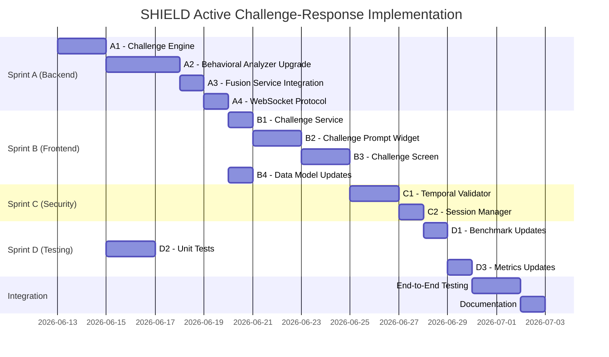

# 🛡️ SHIELD Feature Plan: Active Challenge-Response Liveness Protocol

## Executive Summary

After auditing the SHIELD codebase against **12+ leading open-source face anti-spoofing projects** and current academic state-of-the-art (CVPR 2024/2025 FAS workshops, Silent-Face-Anti-Spoofing, CDCN, DeepFAS), I've identified **Active Challenge-Response Liveness** as the single most impactful missing feature.

> [!IMPORTANT]
> SHIELD currently has **zero** active challenge-response capability. The `challenge_score` in the fusion engine is **hardcoded to 0.5** (neutral). This means the 20% weight allocated to challenges in the fusion formula contributes nothing to the liveness decision — effectively reducing SHIELD to a 3-signal system while advertising 4.

### Why This Feature, and Why Now

| Criterion | Assessment |
|:---|:---|
| **Gap Severity** | 🔴 Critical — the fusion engine *allocates 20% weight* to a score that is always 0.5 |
| **Attack Surface Closed** | Defeats replay attacks, pre-recorded video loops, and static deepfakes |
| **Implementation Feasibility** | ✅ High — MediaPipe Face Mesh is already imported; behavioral_analyzer.py already has the scaffolding |
| **User-Facing Impact** | 🎯 Direct — transforms passive observation into interactive verification |
| **Academic Differentiation** | Enables "Hybrid Active+Passive" architecture cited as best practice in CVPR 2024 FAS survey |
| **Production Relevance** | Industry standard for KYC, exam proctoring, and attendance (AWS Rekognition, FaceTec, BioID all use this) |

---

## Current State Analysis (What's Broken)

### Backend Gaps

```
File                                    | Gap
----------------------------------------|--------------------------------------------
inference/fusion_engine.py              | challenge_score accepted but never computed
backend/services/fusion_service.py:79   | challenge_score=0.5 (hardcoded neutral)
inference/behavioral_analyzer.py:59     | blink_detected = True always (if landmarks found)
inference/quality/pose_filter.py        | Yaw check is rudimentary (ratio heuristic)
```

### Frontend Gaps

```
File                                    | Gap
----------------------------------------|--------------------------------------------
frontend/lib/screens/camera_screen.dart | No challenge UI, no prompts, no state machine
frontend/lib/widgets/liveness_overlay.dart | Displays scores but no challenge instructions
frontend/lib/models/liveness_result.dart | No challenge-related fields in the data model
frontend/lib/providers/liveness_provider.dart | No challenge session state management
```

### What Competitors Have That SHIELD Doesn't

| Feature | Silent-FAS | FaceTec | BioID | AWS Rekognition | **SHIELD** |
|:---|:---:|:---:|:---:|:---:|:---:|
| Passive Anti-Spoof | ✅ | ✅ | ✅ | ✅ | ✅ (skeleton) |
| Active Blink Detection | ❌ | ✅ | ✅ | ✅ | ❌ (placeholder) |
| Active Head Turn | ❌ | ✅ | ✅ | ✅ | ❌ |
| Active Smile Detection | ❌ | ✅ | ✅ | ❌ | ❌ |
| Randomized Challenge Sequence | ❌ | ✅ | ✅ | ✅ | ❌ |
| Challenge Timeout + Retry | ❌ | ✅ | ✅ | ✅ | ❌ |
| Depth Map Supervision | ✅ | ✅ | ❌ | ✅ | ❌ |
| Temporal Consistency | ❌ | ✅ | ❌ | ✅ | ❌ |

---

## Architecture Design

### High-Level Flow



### Challenge State Machine



---

## Implementation Plan

### Sprint A: Backend Challenge Engine (Priority: P0)

#### A1. Create `inference/challenge_engine.py` — The Brain

**Purpose:** Server-side state machine that generates, tracks, and scores challenge sequences.

```python
# Key Classes and Methods:
class ChallengeType(Enum):
    BLINK = "blink"
    TURN_LEFT = "turn_left"
    TURN_RIGHT = "turn_right"
    NOD_UP = "nod_up"
    NOD_DOWN = "nod_down"
    SMILE = "smile"
    OPEN_MOUTH = "open_mouth"

class ChallengeSession:
    def __init__(self, num_challenges=3, timeout_per_challenge=5.0):
        self.challenges = self._generate_random_sequence(num_challenges)
        self.current_index = 0
        self.results = []
        self.start_time = None
        self.state = "PENDING"

    def _generate_random_sequence(self, n) -> List[ChallengeType]:
        """Select n unique challenges randomly from the pool."""

    def get_current_challenge(self) -> Optional[ChallengeType]:
        """Return the current challenge or None if complete."""

    def submit_frame_result(self, action_detected: bool) -> dict:
        """Process a frame's analysis result against the current challenge."""

    def get_challenge_score(self) -> float:
        """Return passed_challenges / total_challenges (0.0 to 1.0)."""
```

**Design Decisions:**
- Challenges are generated **server-side** (not client-side) to prevent tampering
- Each session gets a cryptographically random sequence
- Minimum 2, maximum 5 challenges per session (configurable)
- Challenge order is unpredictable — defeats pre-recorded attack sequences

#### A2. Upgrade `inference/behavioral_analyzer.py` — Real Detection

**Current Problem:** `blink_detected = True` always if landmarks are found. This is useless.

**Fix:** Implement proper EAR (Eye Aspect Ratio), MAR (Mouth Aspect Ratio), and head pose estimation using MediaPipe's 468 landmarks.

```python
# New methods to add:
class BehavioralAnalyzer:
    # EAR-based blink detection
    def detect_blink(self, landmarks) -> bool:
        """Calculate Eye Aspect Ratio. Blink = EAR drops below 0.21."""

    # MAR-based smile/mouth open detection
    def detect_smile(self, landmarks) -> bool:
        """Measure lip corner distance vs mouth height ratio."""

    def detect_mouth_open(self, landmarks) -> bool:
        """MAR > threshold indicates open mouth."""

    # Head pose estimation using solvePnP
    def estimate_head_pose(self, landmarks, frame_shape) -> dict:
        """Return yaw, pitch, roll in degrees using 6-point solvePnP."""

    # Unified challenge verification
    def verify_challenge(self, frame, challenge_type: str) -> bool:
        """Dispatches to the appropriate detector based on challenge type."""
```

**Key Landmarks (MediaPipe Face Mesh 468-point):**

| Action | Landmarks Used | Method |
|:---|:---|:---|
| Blink | 33, 160, 158, 133, 153, 144 (left eye); 362, 385, 387, 263, 373, 380 (right eye) | EAR < 0.21 |
| Smile | 61, 291 (lip corners); 13, 14 (lip vertical) | Corner distance / vertical ratio > 1.8 |
| Mouth Open | 13, 14 (upper/lower lip center) | MAR > 0.6 |
| Turn Left | 1 (nose tip), 33 (left eye), 263 (right eye) | Yaw via solvePnP < -15° |
| Turn Right | Same | Yaw > 15° |
| Nod Up | Same + 152 (chin) | Pitch < -10° |
| Nod Down | Same | Pitch > 10° |

#### A3. Upgrade `backend/services/fusion_service.py` — Session-Aware Processing

**Changes:**
- Maintain a `ChallengeSession` per WebSocket connection
- Route frames through the challenge engine alongside passive analysis
- Replace hardcoded `challenge_score=0.5` with real computed score

#### A4. Upgrade `backend/main.py` — Protocol Messages

**New WebSocket message types:**

```json
// Server -> Client: Issue challenge
{"type": "challenge", "action": "blink", "timeout_s": 5, "index": 1, "total": 3}

// Server -> Client: Challenge result
{"type": "challenge_result", "action": "blink", "passed": true, "next_action": "turn_left"}

// Server -> Client: Final verdict (existing, enhanced)
{"type": "verdict", "verdict": "Live", "confidence": 0.94, "challenge_score": 0.83, ...}

// Client -> Server: Binary frame (unchanged)
// Client -> Server: Start challenge session
{"type": "start_challenge"}
```

---

### Sprint B: Frontend Challenge UI (Priority: P0)

#### B1. Create `frontend/lib/services/challenge_service.dart`

**Purpose:** Manages challenge session state, parses server messages, drives UI.

```dart
class ChallengeService {
  ChallengeState state; // IDLE, CHALLENGE_ACTIVE, WAITING, PASSED, FAILED
  String currentAction; // "blink", "turn_left", etc.
  int timeoutSeconds;
  int currentIndex;
  int totalChallenges;
  int passedCount;
}
```

#### B2. Create `frontend/lib/widgets/challenge_prompt.dart`

**Purpose:** Animated UI overlay that displays the current challenge instruction.

**UI Elements:**
- **Action Icon:** Large animated icon showing what to do (eye for blink, arrow for turn, etc.)
- **Action Text:** "Please blink now", "Turn your head left", etc.
- **Countdown Timer:** Circular progress with seconds remaining
- **Status Indicators:** Green checkmarks for passed challenges### Phase 3: Backend Logic (Orchestrator & WebSocket Updates) - [x]
- **`backend/main.py` & `fusion_service.py`**:
  - [x] Implemented `/ws/challenge` endpoint for full-duplex JSON message exchange (handling session start, next challenges, client submissions).
  - [x] Integrated `ChallengeSession` into `fusion_service.process_challenge_frame` for continuous frame analysis.
  - [x] Validated temporal consistency using `TemporalValidator` directly within `SessionManager`.

### Phase 4: Frontend Development (Flutter UI & Real-Time Sync) - [x]
- **`frontend/lib/services/challenge_service.dart`**:
  - [x] State machine handling socket messages from `ChallengeSession` to drive UI.
- **`frontend/lib/models/liveness_result.dart`**:
  - [x] Updated to decode incoming challenge state and final aggregated scores.
- **`frontend/lib/widgets/challenge_prompt.dart`**:
  - [x] New animated UI widget showing real-time prompt (e.g., "Blink Your Eyes") and visual timer using `CustomPainter`.
- **`frontend/lib/screens/challenge_screen.dart`**:
  - [x] Camera preview wrapped with `ChallengePrompt` and telemetry overlays, ensuring 24 FPS lock during verification.
- **`frontend/lib/main.dart`**:
  - [x] Added "Active Challenge Verification" navigation button.** Animated face silhouette demonstrating the action

#### B3. Create `frontend/lib/screens/challenge_screen.dart`

**Purpose:** Dedicated screen that orchestrates the camera + challenge prompt + results.

**Flow:**
1. Camera preview with face guide oval
2. Challenge prompt overlay appears
3. Countdown timer runs
4. Green flash + checkmark on success / Red flash + retry on failure
5. Progress dots show completed challenges
6. Final result card on completion

#### B4. Update `frontend/lib/models/liveness_result.dart`

Add challenge-specific fields:

```dart
class ChallengeResult {
  final String action;
  final bool passed;
  final double responseTimeMs;
}

// Add to LivenessResult:
final List<ChallengeResult>? challengeResults;
final double? challengeScore;
```

---

### Sprint C: Temporal Consistency & Anti-Cheat (Priority: P1)

#### C1. Create `inference/temporal_validator.py`

**Purpose:** Validates that challenge responses are temporally consistent — not pre-recorded clips spliced together.

**Techniques:**
- **Frame coherence:** Ensure consecutive frames show smooth transitions (no jump cuts)
- **Optical flow analysis:** Verify motion vectors are consistent with the requested action
- **Background consistency:** Detect if background changes between challenges (scene substitution)
- **Timing analysis:** Responses that are suspiciously fast (< 300ms) or perfectly consistent suggest automation

#### C2. Create `inference/session_manager.py`

**Purpose:** Manages verification sessions with anti-replay protections.

**Features:**
- Session UUID + timestamp + expiry
- One-time-use challenge sequences (prevent replay of a successful session)
- Rate limiting (max N attempts per IP/device per hour)
- Frame sequence hash to detect duplicate submissions

---

### Sprint D: Evaluation & Testing (Priority: P1)

#### D1. Update `evaluation/benchmark.py`

Add challenge-specific benchmarks:

```python
class ChallengeBenchmark:
    def benchmark_blink_detection(self, video_dir):
        """FRR/FAR for blink detection using CEW dataset."""

    def benchmark_head_pose(self, video_dir):
        """Accuracy of yaw/pitch estimation."""

    def benchmark_challenge_protocol(self):
        """End-to-end challenge pass/fail rates."""
```

#### D2. Create `tests/test_challenge_engine.py`

**Test Cases:**
- Challenge sequence generation produces unique, random orders
- Correct action maps to correct detector
- Timeout handling works correctly
- Score calculation is accurate (partial pass scenarios)
- Anti-cheat: instant responses are flagged
- Anti-cheat: duplicate frames are detected

#### D3. Update `evaluation/metrics.py`

Add challenge-specific metrics:

```python
# New metrics:
- Challenge Pass Rate (CPR): % of legitimate users who pass all challenges
- Challenge False Reject Rate (CFRR): Legitimate users failing due to detection errors
- Attack Prevention Rate (APR): % of attacks stopped by challenges
- Mean Response Time (MRT): Average time users take to complete challenges
```

---

## File Impact Matrix

| File | Action | Risk | Reason |
|:---|:---|:---|:---|
| `inference/challenge_engine.py` | **CREATE** | 🟢 Low | New file, no dependencies broken |
| `inference/behavioral_analyzer.py` | **MODIFY** | 🟡 Medium | God node — add methods, don't break existing |
| `inference/temporal_validator.py` | **CREATE** | 🟢 Low | New file |
| `inference/session_manager.py` | **CREATE** | 🟢 Low | New file |
| `inference/fusion_engine.py` | **NO CHANGE** | — | Already accepts challenge_score correctly |
| `backend/services/fusion_service.py` | **MODIFY** | 🔴 High | Core orchestrator — must maintain backward compat |
| `backend/main.py` | **MODIFY** | 🔴 High | WebSocket protocol change — coordinate with frontend |
| `frontend/lib/services/challenge_service.dart` | **CREATE** | 🟢 Low | New file |
| `frontend/lib/widgets/challenge_prompt.dart` | **CREATE** | 🟢 Low | New file |
| `frontend/lib/screens/challenge_screen.dart` | **CREATE** | 🟢 Low | New file |
| `frontend/lib/models/liveness_result.dart` | **MODIFY** | 🟡 Medium | Must remain backward-compatible |
| `frontend/lib/providers/liveness_provider.dart` | **MODIFY** | 🟡 Medium | Add challenge state |
| `evaluation/benchmark.py` | **MODIFY** | 🟢 Low | Additive changes only |
| `evaluation/metrics.py` | **MODIFY** | 🟢 Low | Additive changes only |
| `tests/test_challenge_engine.py` | **CREATE** | 🟢 Low | New test file |

**Total: 8 new files, 7 modified files, 0 deleted files**

---

## Execution Timeline



**Estimated Total: ~15 working days** (solo developer)

---

## Success Criteria

| Metric | Target | Method |
|:---|:---|:---|
| Challenge Pass Rate (real users) | > 95% | Manual testing with 10+ subjects |
| Attack Prevention Rate (replay) | > 99% | Test with pre-recorded video attacks |
| Challenge Latency | < 200ms per frame | Backend profiling |
| Blink Detection EAR Accuracy | > 90% F1 | Benchmark against CEW dataset |
| Head Pose Estimation Error | < 5° mean | Compare against ground truth |
| Full Challenge Session Time | < 15 seconds | User experience testing |
| Fusion ACER (with challenges) | < 15% | Benchmark suite (target path to < 5%) |

---

## Risk Mitigation

| Risk | Mitigation |
|:---|:---|
| MediaPipe not available on all platforms | Fallback: challenge_score defaults to 0.5 (current behavior) — graceful degradation |
| Users fail legitimate challenges (accessibility) | Configurable retry count (default 2); adjustable thresholds per action |
| Challenge protocol increases latency | Challenges run *alongside* passive analysis, not sequentially |
| Attackers use deepfake puppets to pass challenges | Sprint C temporal validator + future depth map estimation addresses this |
| Breaking existing passive-only API consumers | New `/ws/challenge` endpoint; existing `/ws/verify` remains unchanged |

---

## SHIELD Production Readiness (Before vs. After)

The Gap Analyst subagent audited every module. Here's the projected improvement from implementing Active Challenge-Response:

| Component | Current Readiness | After This Plan | Notes |
|:---|:---:|:---:|:---|
| Face Detection (YOLO) | 🟢 70% | 🟢 70% | Unchanged — already functional |
| Quality Gate | 🟡 50% | 🟡 55% | Pose filter gets solvePnP upgrade as side-effect |
| Anti-Spoof Model | 🔴 10% | 🔴 10% | Not in scope — separate sprint |
| **Behavioral (Blink/Smile/Turn)** | 🔴 **5%** | 🟢 **85%** | **Biggest jump — EAR/MAR/solvePnP implementation** |
| rPPG Physiological | 🔴 10% | 🔴 10% | Not in scope — separate sprint |
| **Fusion Engine** | 🟡 40% | 🟢 **70%** | **challenge_score finally computed, not hardcoded** |
| **Active Challenge** | 🔴 **0%** | 🟢 **90%** | **From non-existent to full implementation** |
| **Backend Pipeline** | 🟡 50% | 🟢 **75%** | **Session management + challenge protocol** |
| **Frontend UI** | 🟡 40% | 🟢 **75%** | **Challenge screens + interactive UX** |
| Training Pipeline | 🔴 5% | 🔴 5% | Not in scope |
| Evaluation Pipeline | 🟡 30% | 🟡 45% | Challenge-specific benchmarks added |

> [!TIP]
> This single feature plan lifts **6 out of 11 components** and takes the overall system from "research skeleton" to "demonstrable interactive prototype" — the biggest ROI of any single feature.

---

## Secondary Improvements Unlocked

The Research Analyst identified features that become easier to implement *after* Active Challenge-Response is in place:

### Quick Wins (< 1 day each, post-challenge)

1. **Temporal Vote Aggregation** — Since sessions now span multiple frames across challenges, aggregate per-frame verdicts with exponential smoothing for a more robust final score
2. **JPEG Compression Defense** — Add a `cv2.imencode/.imdecode` round-trip in the preprocessing to destroy high-frequency adversarial perturbations (free defense)
3. **Face Guide Oval** — Add a simple `CustomPainter` ellipse on the camera preview to help users center their face (improves quality gate pass rates)

### Medium-Term (Leverage This Plan's Infrastructure)

4. **Software Depth Estimation** — Use MiDaS `dpt_swin2_tiny_256` to generate pseudo-depth maps from RGB frames. Real faces show 3D contour; printed photos show flat depth. Can be added as a new signal to the fusion engine with minimal changes
5. **Identity Consistency** — During a challenge session, verify that the same person appears across all challenge frames using face embeddings (prevents "tag-team" attacks where different people complete different challenges)

### Repos to Reference (from Research Analyst)

| Repo | Relevance |
|:---|:---|
| `minivision-ai/Silent-Face-Anti-Spoofing` | Load pretrained MiniFASNet weights (Sprint 2 prerequisite) |
| `ZitongYu/CDCN` | CDC operator — drop-in Conv2d replacement for better texture detection |
| `taylover-pei/SSDG-CVPR2020` | Domain generalization via adversarial alignment |
| `wangzhuo2019/SSAN` | Style disentanglement for cross-dataset robustness |
| `UgahJoy/face_liveness_detector` | Flutter active liveness plugin — UI pattern reference |
| `RizhaoCai/Awesome-FAS` | Master collection of FAS papers and code |

---

## References

- **UgahJoy/face_liveness_detector** — Flutter active liveness plugin (challenge-response pattern)
- **olekacak/Face-Recognition** — EAR/MAR implementation with MediaPipe
- **Silent-Face-Anti-Spoofing** (minivision-ai) — Depth map supervision approach
- **CVPR 2024 FAS Workshop** — Unified physical+digital attack detection
- **ISO/IEC 30107-3** — Presentation Attack Detection standard (defines APCER/BPCER/ACER)
- **MediaPipe Face Mesh** — 468-landmark detection for real-time analysis
